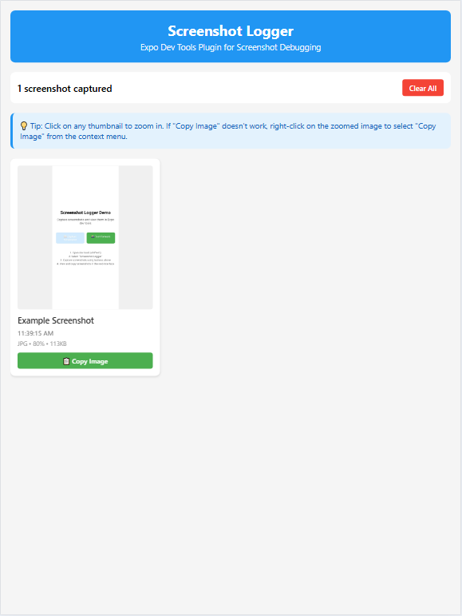

# 📸 Expo Screenshot Logger

An Expo dev tools plugin for capturing and viewing React Native screenshots in your browser for easy sharing or debugging with AI assistants.

## ✨ Features

- 📱 **Instant Screenshot Capture** - Use `captureScreenshot()` from anywhere in your React Native app
- 🌐 **Browser Interface** - View screenshots in Expo dev tools with click-to-enlarge
- 📋 **Copy to Clipboard** - Copy images directly for sharing with team members or AI assistants
- 🎯 **Smart Labeling** - Add custom labels and see timestamps for each screenshot
- ⚡ **Real-time Sync** - Screenshots appear instantly in the browser interface
- 🖼️ **High Quality** - Support for PNG/JPG with customizable quality settings

### Screenshots
These screenshots are of the tool capturing screenshots of the example app (see /example).

Initial load of the expo-screenshot-logger dev tool plugin:


We have now captured a screenshot of our example app and we can see it in our dev tool:



We can click on the image to zoom-in and copy to our clipboard for sharing:


## 🚀 Quick Start

### Installation

```bash
npm install expo-screenshot-logger react-native-view-shot
```

### Setup

#### 1. Initialize in your app's root layout
Add the screenshot logger to your app's root layout file (typically `app/_layout.tsx`):

```javascript
import { useScreenshotLogger } from 'expo-screenshot-logger';

function AppContent() {
  // Initialize screenshot logger (must be called at root level)
  useScreenshotLogger();
  
  // ... rest of your app content
}
```

#### 2. Usage in Components

**Recommended Pattern: Dynamic Import**
```javascript
const handleScreenshot = async () => {
  // Import the module dynamically to get the updated function reference
  const { captureScreenshot } = await import('expo-screenshot-logger');
  await captureScreenshot('My Screen Label');
};
```

**Complete Example:**

Here we have set up a touchable text component (could be a header) as a discreet way of capturing screenshots from our app:
```javascript
import React from 'react';
import { TouchableOpacity, Text } from 'react-native';

export function MyComponent({ title }) {
  const handleTitlePress = async () => {
    // Import the module dynamically to get the updated function reference
    const { captureScreenshot } = await import('expo-screenshot-logger');
    await captureScreenshot(title);
  };

  return (
    <TouchableOpacity onPress={handleTitlePress}>
      <Text>{title}</Text>
    </TouchableOpacity>
  );
}
```

### View Screenshots

1. **Start your app**: Run `npx expo start`
2. **Open dev tools**: Press `shift+m` to open Expo dev tools
3. **Find the plugin**: Click "Screenshot Logger" in the tools list
4. **Capture screenshots**: Use the dynamic import pattern in your app
5. **Copy images**: 
   - Click "📋 Copy Image" button, OR
   - Click on any thumbnail to zoom in, then right-click and select "Copy Image" from context menu
6. **Share**: Paste directly into messaging apps or AI assistants like Claude, ChatGPT, etc.

## 🤝 Contributing

Contributions are welcome! Please:

1. Fork the repository
2. Create a feature branch
3. Add tests for new functionality
4. Update documentation
5. Submit a pull request

## 📄 License

MIT License - see LICENSE file for details

## 🙏 Acknowledgments

- Built with Expo dev tools infrastructure
- Uses react-native-view-shot for screenshot capture

---

**Made with ❤️ for the React Native community**