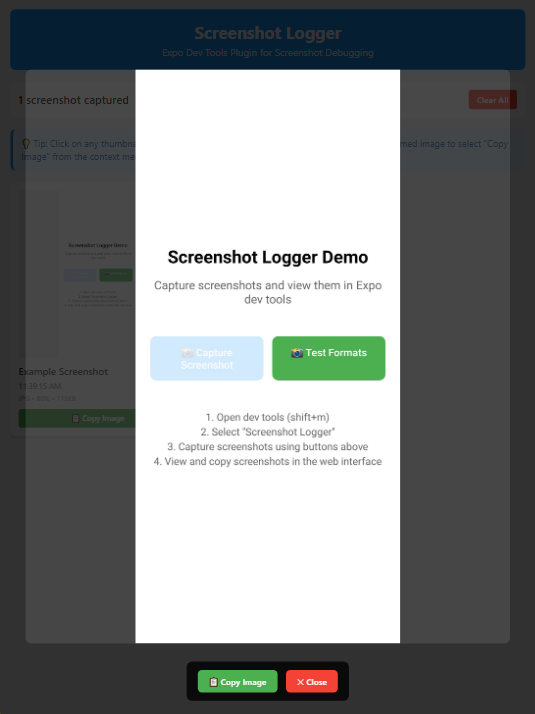

# 📸 Expo Screenshot Logger

An Expo dev tools plugin for capturing and viewing React Native screenshots in your browser for easy sharing and debugging.

## ✨ Features

- 📱 **Instant Screenshot Capture** - Use `captureAndSend()` from anywhere in your React Native app
- 🌐 **Browser Interface** - View screenshots in Expo dev tools with click-to-enlarge
- 📋 **Copy to Clipboard** - Get data URLs ready for sharing with colleagues or AI assistants
- 🎯 **Smart Labeling** - Add custom labels and see timestamps for each screenshot
- ⚡ **Real-time Sync** - Screenshots appear instantly in the browser interface
- 🖼️ **High Quality** - Support for PNG/JPG with customizable quality settings

### Screenshots




## 🚀 Quick Start

### Installation

```bash
npm install expo-screenshot-logger react-native-view-shot
```

### Usage

```javascript
import { useScreenshotLogger } from 'expo-screenshot-logger';

export default function App() {
  const { captureAndSend } = useScreenshotLogger();

  const handleScreenshot = () => {
    captureAndSend('Home Screen');
  };

  return (
    <TouchableOpacity onPress={handleScreenshot}>
      <Text>📸 Capture Screenshot</Text>
    </TouchableOpacity>
  );
}
```

### View Screenshots

1. Run your app with `npx expo start`
2. Press `shift+m` to open dev tools
3. Click "Screenshot Logger" in the tools list
4. Capture screenshots in your app
5. Click "📋 Copy Data URL" to share with AI assistants

## 🤝 Contributing

Contributions are welcome! Please:

1. Fork the repository
2. Create a feature branch
3. Add tests for new functionality
4. Update documentation
5. Submit a pull request

## 📄 License

MIT License - see LICENSE file for details

## 🙏 Acknowledgments

- Built with Expo dev tools infrastructure
- Uses react-native-view-shot for screenshot capture

---

**Made with ❤️ for the React Native community**